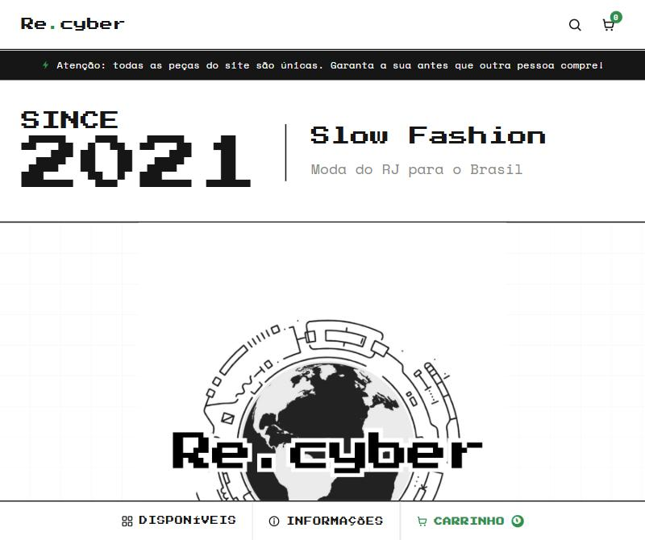
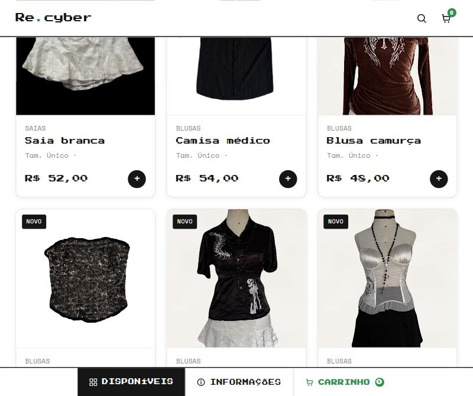

# Re.cyber

Loja virtual de brechó/moda slow fashion — peças únicas, vendidas direto do site, com todo o fluxo de compra (catálogo, carrinho, pagamento, envio e notificações) automatizado de ponta a ponta.

🔗 **Site no ar:** [recyber.com.br](https://recyber.com.br)




## Visão geral

O Re.cyber resolve o problema de vender peças únicas de brechó sem depender de planilha manual ou marketplace de terceiros: o dono cadastra a peça pelo painel administrativo (ou por automação, sem precisar logar), ela aparece na hora no catálogo público, e a partir daí o site cuida sozinho de pagamento (Pix/Cartão), cálculo e geração de etiqueta de frete, e-mails de confirmação/rastreio, e aviso de peça vendida.

Principais funcionalidades:

- **Catálogo dinâmico** por categorias, com tamanhos/medidas por peça, campanhas de desconto (Modo Promo) e feed de produtos pro Instagram Shopping, Meta Commerce Manager e TikTok Shop.
- **Checkout com pagamento integrado** via InfinitePay (Pix e Cartão de Crédito), desconto automático/cupom e frete grátis configurável.
- **Frete automático** via Melhor Envio: calcula o mais barato entre as transportadoras disponíveis e gera a etiqueta assim que o pagamento é aprovado.
- **Painel administrativo** completo: cadastro/edição de peças, gestão de pedidos e clientes, lista de marketing, configuração de mensagens de e-mail.
- **Notificações automáticas** por e-mail (cliente e admin) a cada evento importante do pedido.
- **PWA** — instalável na tela inicial do celular.

## Tecnologias utilizadas

| Camada | Tecnologia |
|---|---|
| Front-end | HTML, CSS e JavaScript puro (sem framework) |
| Backend / API | [Cloudflare Workers](https://workers.cloudflare.com/) (`worker.js`) |
| Banco de dados e autenticação | [Supabase](https://supabase.com/) (Postgres + Auth) |
| Armazenamento de imagens | [Cloudflare R2](https://developers.cloudflare.com/r2/) |
| Pagamentos | [InfinitePay](https://www.infinitepay.io/) (Pix e Cartão) |
| Frete | [Melhor Envio](https://melhorenvio.com.br/) |
| E-mail transacional | [Resend](https://resend.com/) |
| Hospedagem/deploy | Cloudflare (deploy automático via push no GitHub) |

## Como executar localmente

1. Clone o repositório:
   ```bash
   git clone https://github.com/nandevil/RECYBER.git
   cd RECYBER
   ```
2. Suba um servidor estático local pra ver o front-end (ex.: o script incluso no projeto):
   ```powershell
   ./server.ps1
   ```
   ou qualquer outro servidor estático de sua preferência (`npx serve`, extensão Live Server, etc).
3. Para testar o backend completo (API, pagamento, frete, e-mail), é necessário configurar um projeto próprio no Supabase e no Cloudflare Workers — o passo a passo detalhado está em [`SUPABASE.md`](SUPABASE.md).
4. O deploy em produção acontece automaticamente: todo push na branch `master` é publicado no Cloudflare via integração com o GitHub.

## Créditos

Desenvolvido por [**nandevil**](https://github.com/nandevil).
